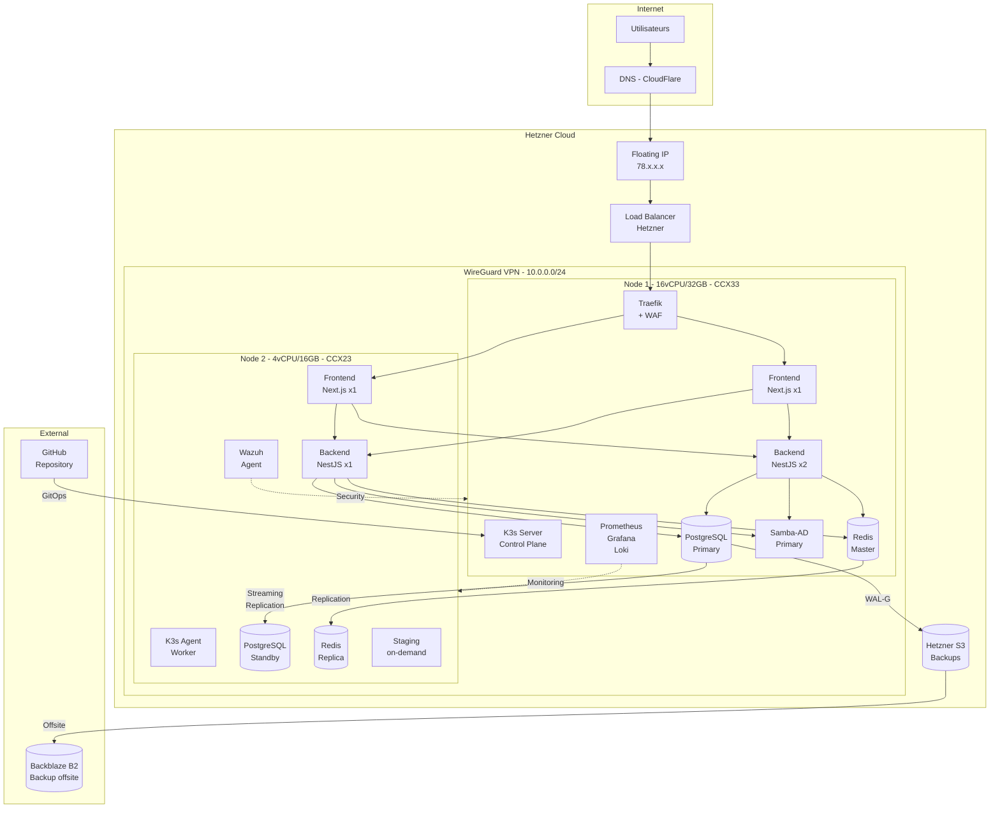
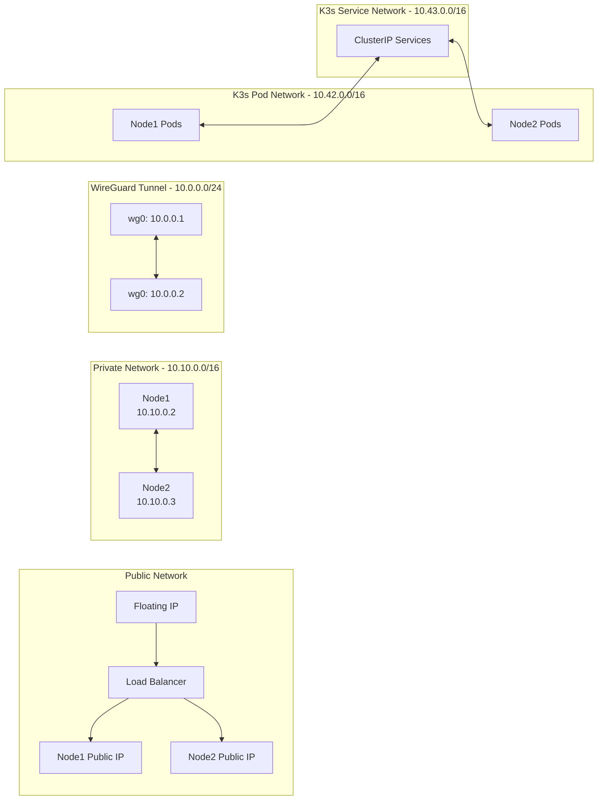
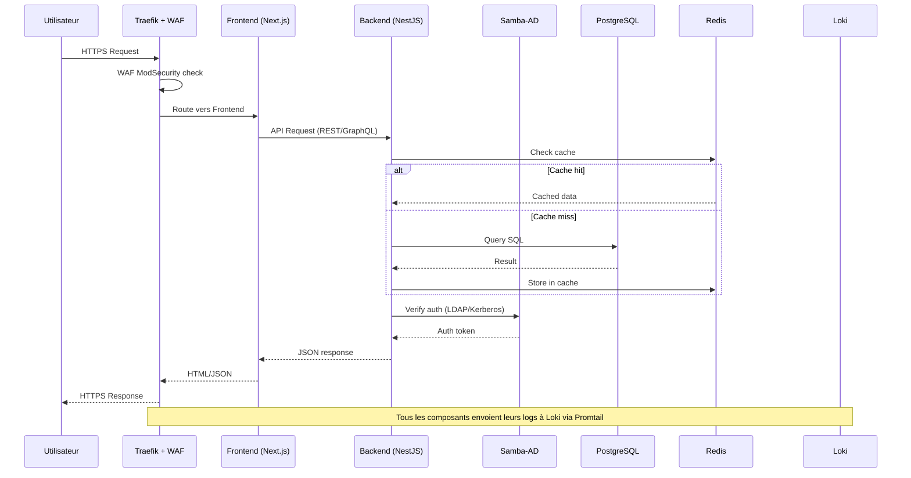

# Architecture détaillée

## Diagramme d'architecture globale



## Diagramme réseau



## Diagramme de flux de données



## Choix d'architecture

### Pourquoi K3s et non K8s vanilla ?

- **Empreinte mémoire réduite** : ~512MB vs ~2GB pour le control plane
- **Binaire unique** : Installation simplifiée
- **SQLite/etcd intégré** : Pas besoin d'etcd externe
- **Traefik intégré** : Ingress controller inclus
- **Certifié CNCF** : Conformité Kubernetes garantie
- **Adapté pour 2 nodes** : Conçu pour les petits clusters

### Pourquoi Patroni pour PostgreSQL ?

- **Failover automatique** : Promotion standby en < 30s
- **DCS intégré** : Consensus distribué sans dépendance externe (utilise K8s endpoints)
- **Streaming replication** : RPO proche de 0 en mode synchrone
- **Compatible WAL-G** : Backup continu intégré

### Pourquoi Redis Sentinel et non Cluster ?

- **2 nodes seulement** : Redis Cluster nécessite minimum 6 nodes
- **Sentinel** : Supervision + failover automatique avec 2 instances
- **Simplicité** : Configuration simple, adapté à la taille du projet

### Pourquoi Samba-AD ?

- **Solution open-source** : Active Directory compatible sans licence
- **LDAP + Kerberos + SSO** : Triple protocole d'authentification
- **Integration NestJS** : passport-ldapauth + passport-kerberos
- **RNCP** : Demontre competences AD dans contexte entreprise

### Pourquoi Traefik v3.0 ?

- **Natif Kubernetes** : CRDs IngressRoute, pas de fichiers de config statiques
- **TLS automatique** : Integration cert-manager native
- **Middleware chain** : Composable (headers, rate-limit, WAF, compress)
- **Metriques Prometheus** : Exposition native avec buckets personnalises
- **ProxyProtocol v2** : Compatible Hetzner Load Balancer
- **Performances** : Adapte aux 2 nodes, empreinte legere

### Pourquoi ArgoCD (et non Flux) ?

- **Interface Web** : Visualisation de l'etat des applications
- **App of Apps** : Pattern de deploiement hierarchique
- **Sync Waves** : Ordre de deploiement garanti (DB avant apps)
- **Self-healing** : Correction automatique des drifts
- **Rollback** : Retour arriere en 1 commande
- **RBAC integre** : Roles differencies (admin, developer, readonly)

---

## Securite : Defense in Depth

```
Layer 1: Hetzner Cloud Firewall
  └── TCP 80/443 only, deny all other
    Layer 2: Hetzner Load Balancer
      └── TCP passthrough, ProxyProtocol v2, health checks
        Layer 3: Traefik + WAF ModSecurity
          └── OWASP CRS 4.0, Paranoia Level 2, block mode
            Layer 4: TLS 1.3 + Security Headers
              └── HSTS, CSP, X-Frame-Options, ECDSA P-256
                Layer 5: Rate Limiting
                  └── Default 100/s, API 50/s, Auth 10/min
                    Layer 6: NetworkPolicies Zero Trust
                      └── Deny-all + whitelist per namespace
                        Layer 7: RBAC + Secrets
                          └── ServiceAccounts, SealedSecrets, PSS
```

| Couche | Technologie | Menace contree |
|--------|-------------|---------------|
| Firewall Hetzner | iptables cloud | Scan de ports, acces non autorise |
| Load Balancer | Hetzner LB11 | DDoS volumetrique (mitigation provider) |
| WAF | ModSecurity CRS 4.0 | SQL injection, XSS, OWASP Top 10 |
| TLS | cert-manager, TLS 1.3 | Interception, MITM |
| Rate Limiting | Traefik middleware | Brute force, credential stuffing |
| NetworkPolicies | Kubernetes CNI | Mouvement lateral, exfiltration |
| RBAC | K8s RBAC + ArgoCD | Escalade de privileges |
| SealedSecrets | Bitnami controller | Exposition de secrets dans Git |

---

## Haute Disponibilite

### Strategie de deploiement par composant

| Composant | Type K8s | Replicas | Anti-Affinity | Failover |
|-----------|----------|----------|---------------|----------|
| PostgreSQL | StatefulSet | 2 (Primary + Standby) | Strict | Patroni auto < 30s |
| Redis | StatefulSet | 2 (Master + Replica) | Strict | Sentinel auto < 15s |
| Samba-AD | StatefulSet | 1 | N/A | Manual restart |
| Backend | Deployment | 3 (HPA 3-6) | Preferred | K8s auto |
| Frontend | Deployment | 2 (HPA 2-4) | Preferred | K8s auto |
| Traefik | Deployment | 2 | Strict | K8s auto |
| Prometheus | StatefulSet | 1 | Preferred Node 1 | Auto restart |
| Grafana | Deployment | 1 | Preferred Node 1 | Auto restart |

### Distribution sur les nodes

```
Node 1 (CCX33 - 16 vCPU / 32 GB)        Node 2 (CCX23 - 4 vCPU / 16 GB)
Usage CPU: ~60% / Memory: ~70%           Usage CPU: ~50% / Memory: ~60%

[PostgreSQL PRIMARY]                     [PostgreSQL STANDBY]
[Redis MASTER]                           [Redis REPLICA]
[Samba-AD DC]                            [Backend x1]
[Backend x2]                             [Frontend x1]
[Frontend x1]                            [Traefik x1]
[Traefik x1]                             [Promtail]
[Prometheus]                             [Node Exporter]
[Grafana]
[Loki]
[AlertManager]
[Promtail]
[Node Exporter]
```

### Scenarios de panne

| Scenario | Impact | RTO | Mecanisme |
|----------|--------|-----|-----------|
| Pod crash (backend) | Aucun (replicas) | < 10s | Kubernetes reschedule |
| Pod crash (database) | Basculement HA | < 30s PG, < 15s Redis | Patroni / Sentinel |
| Node 2 down | Perte replicas | < 2 min | Pods reschedules sur Node 1 |
| Node 1 down | Control plane down | < 5 min | Reboot Hetzner, Patroni failover |
| Les 2 nodes down | Service indisponible | < 1h | Restore Terraform + WAL-G |
| Corruption DB | Perte donnees possible | < 1h | PITR WAL-G |
| Attaque DDoS | Degradation | < 5 min | WAF + Rate limit + Hetzner FW |

---

## Backup et Disaster Recovery

### Strategie de sauvegarde

```
                    RPO < 15 min
                        |
    ┌───────────────────┼───────────────────┐
    |                   |                   |
PostgreSQL          Redis               Configuration
    |                   |                   |
WAL-G continu       RDB snapshots       Git repository
    |               (toutes les 60min)      |
    v                   v                   v
Hetzner S3          Hetzner S3          GitHub
```

| Donnee | Methode | Frequence | Retention | Stockage |
|--------|---------|-----------|-----------|----------|
| PostgreSQL (full) | WAL-G backup-push | Quotidien 2h | 30 jours | Hetzner S3 |
| PostgreSQL (WAL) | WAL-G archiving continu | Continu | 7 jours | Hetzner S3 |
| Redis (RDB) | redis-cli BGSAVE | Toutes les 60 min | 7 jours | Hetzner S3 |
| Redis (AOF) | appendonly yes | Continu (everysec) | Local | PVC |
| Configuration | Git (GitOps) | Chaque commit | Illimite | GitHub |
| Secrets | SealedSecrets | Chaque rotation | Illimite | GitHub (chiffre) |

### Procedure de Disaster Recovery (PRA)

```
Etape 1: Provisionner l'infrastructure (Terraform)
  terraform apply → 2 nodes + reseau + volumes
  Duree estimee : 5-10 min

Etape 2: Installer K3s
  Scripts install/ → cluster K3s operationnel
  Duree estimee : 5 min

Etape 3: Deployer les services (ArgoCD)
  App of Apps → tous les services deployes
  Duree estimee : 10-15 min

Etape 4: Restaurer les donnees (WAL-G)
  wal-g backup-fetch LATEST → PostgreSQL restaure
  Duree estimee : 10-30 min (selon volume)

RTO total estime : < 1 heure
```

---

## Evolutions futures

| Evolution | Priorite | Description |
|-----------|----------|-------------|
| Monitoring avance | Haute | Jaeger (tracing distribue), OpenTelemetry |
| Multi-cluster | Moyenne | 3eme node pour quorum etcd, HA control plane |
| Backup offsite | Haute | Replication S3 → Backblaze B2 (2eme region) |
| SSO complet | Moyenne | Keycloak + OIDC pour toutes les apps |
| Service Mesh | Basse | Linkerd pour mTLS inter-services |
| Staging permanent | Moyenne | Namespace staging avec ressources reduites |
| Observabilite | Haute | SLO/SLI Prometheus (Sloth), Error Budget |
| CI/CD avance | Moyenne | Canary deployments, Blue/Green |
