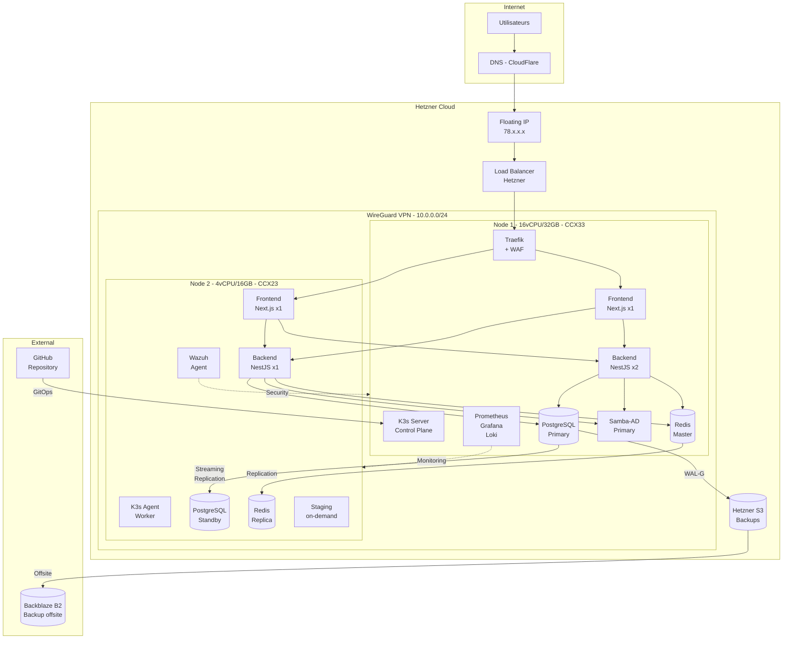
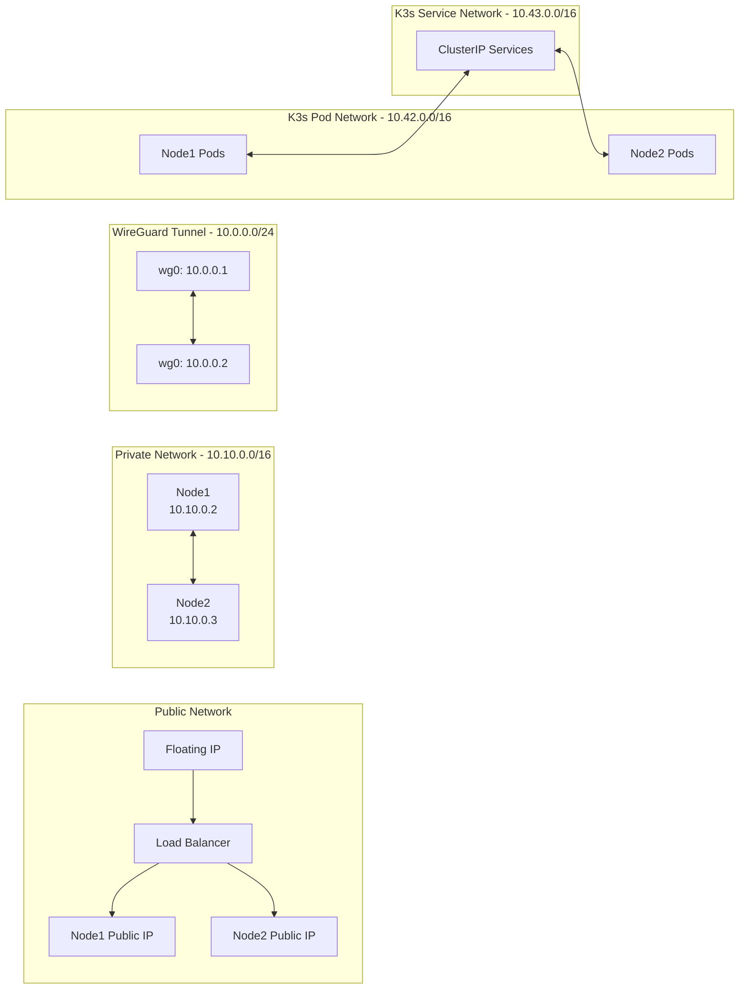
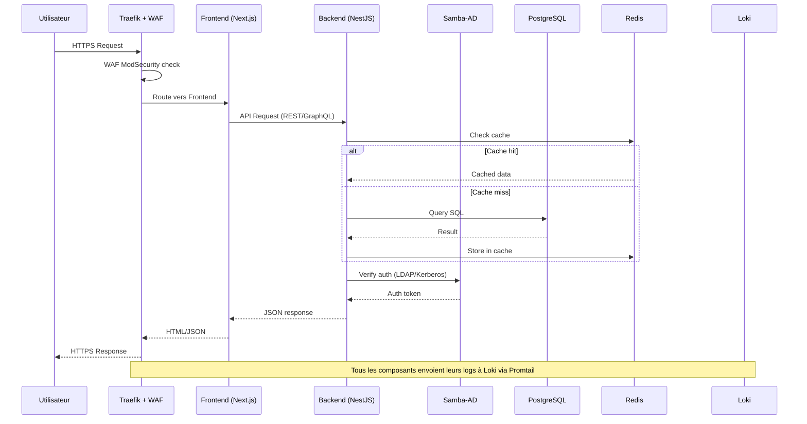

# Architecture détaillée

## Diagramme d'architecture globale

## Diagramme réseau

## Diagramme de flux de données

## Choix d'architecture

### Pourquoi K3s et non K8s vanilla ?

- **Empreinte mémoire réduite** : ~512MB vs ~2GB pour le control plane
- **Binaire unique** : Installation simplifiée
- **SQLite/etcd intégré** : Pas besoin d'etcd externe
- **Traefik intégré** : Ingress controller inclus
- **Certifié CNCF** : Conformité Kubernetes garantie
- **Adapté pour 2 nodes** : Conçu pour les petits clusters

### Pourquoi Patroni pour PostgreSQL ?

- **Failover automatique** : Promotion standby en < 30s
- **DCS intégré** : Consensus distribué sans dépendance externe (utilise K8s endpoints)
- **Streaming replication** : RPO proche de 0 en mode synchrone
- **Compatible WAL-G** : Backup continu intégré

### Pourquoi Redis Sentinel et non Cluster ?

- **2 nodes seulement** : Redis Cluster nécessite minimum 6 nodes
- **Sentinel** : Supervision + failover automatique avec 2 instances
- **Simplicité** : Configuration simple, adapté à la taille du projet

### Pourquoi Samba-AD ?

- **Solution open-source** : Active Directory compatible sans licence
- **LDAP + Kerberos + SSO** : Triple protocole d'authentification
- **Intégration NestJS** : passport-ldapauth + passport-kerberos
- **RNCP** : Démontre compétences AD dans contexte entreprise
